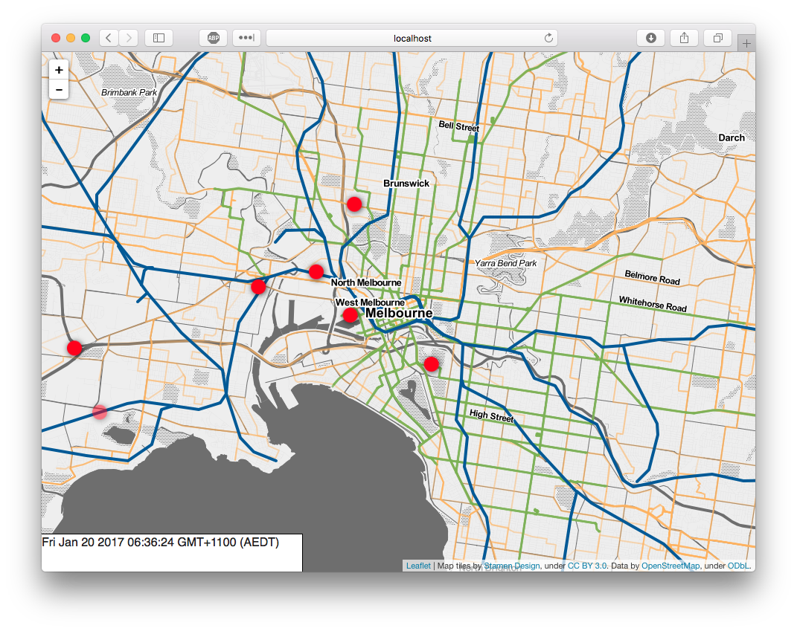

# transport-heartbeat
A web application to visualize public transport in Melbourne Australia

## Summary

This is a project to map major public transport routes in Melbourne Australia and add a visual pulse when a departure occurs on the map. I thought it would be interesting to be able to see how public transport flows through a city.

I think it would also be cool to attach sound effects to different events so you could hear the "heartbeat" of the transport network.

It is just something I am playing around with when I have time.

## Acknowledgments

Public transport timetable data provided by Public Transport Victoria under the Creative Commons Attribution 4.0 International license.

This dataset provides static timetable data and geographic information in the The General Transit Feed Specification (GTFS) format. It contains scheduled information for all metropolitan and regional trains, all metropolitan and regional bus (including coach) and all metropolitan tram services in Victoria.

For more info please see the source website at: [https://www.data.vic.gov.au/data/dataset/ptv-timetable-and-geographic-information-2015-gtfs](https://www.data.vic.gov.au/data/dataset/ptv-timetable-and-geographic-information-2015-gtfs)
